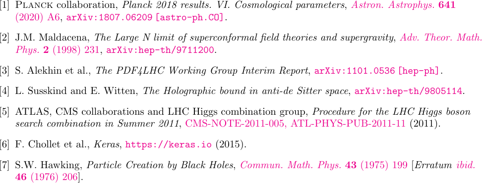

JHEP-mod.bst
============

[`JHEP-mod.bst`](https://raw.githubusercontent.com/tueda/JHEP-mod.bst/v21.07.0/JHEP-mod.bst)
is a modified version of `JHEP.bst` of the JHEP journals
(see the [JHEP site](https://jhep.sissa.it/jhep/help/JHEP_TeXclass.jsp) for the original version).

Changes
-------

- Output the prefix "arXiv:" and the primary class
  (in the new [arXiv identifier scheme](https://arxiv.org/help/arxiv_identifier))
  for each preprint.

- Remove square brackets around preprint numbers in `article`.

- Introduce BibTeX fields for describing errata in `article`:
  - `erratum.prefix` (optional, default: `Erratum`)
  - `erratum.journal` (optional, default: `ibid.`)
  - `erratum.volume`
  - `erratum.year`
  - `erratum.number` (optional, currently not used)
  - `erratum.pages`
  - `erratum.doi` (optional)

- Support the `reportNumber` field in `article`. It is used when both `journal`
  and `eprint` are missing. Link if `url` is provided.

- Use a more consistent style for `misc`.

| JHEP-mod.bst 21.07.0                            |
| ----------------------------------------------- |
|  |

| JHEP.bst 2.18                                   |
| ----------------------------------------------- |
|          |

Licence
-------
[LPPL 1.3c](LICENSE) (or any later version)
